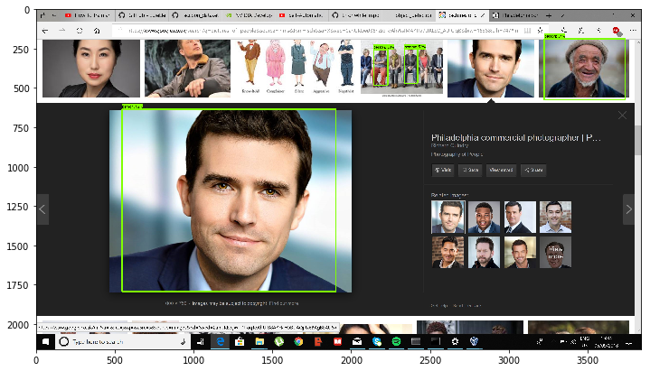
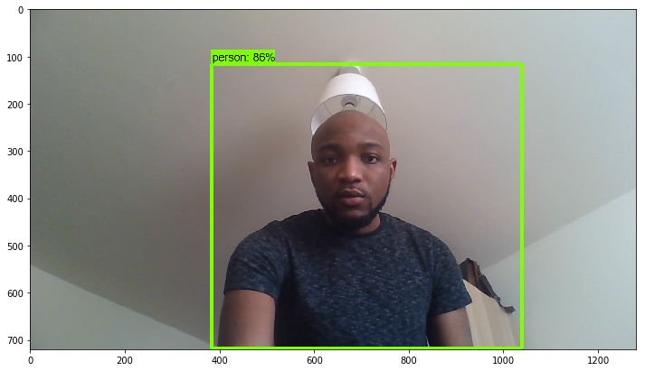

# Object Detection
Object detection notebook. Testing SSD mobilenet classifier model. Initial display before retraining model for realtime Webcam object detection.  

# Imports


```python
from distutils.version import StrictVersion
import numpy as np
import os
import six.moves.urllib as urllib
import sys
import tarfile
import tensorflow as tf
import zipfile

from collections import defaultdict
from io import StringIO
from matplotlib import pyplot as plt
from PIL import Image

# This is needed since the notebook is stored in the object_detection folder.
sys.path.append("..")
from object_detection.utils import ops as utils_ops

if StrictVersion(tf.__version__) < StrictVersion('1.5.0'):
  raise ImportError('Please upgrade your TensorFlow installation to v1.9.* or later!')

```

## Env setup


```python
# This is needed to display the images.
%matplotlib inline
```

## Object detection imports
Here are the imports from the object detection module.


```python
from utils import label_map_util

from utils import visualization_utils as vis_util
```

    E:\Program Files\tensorflow1\models\research\object_detection\utils\visualization_utils.py:25: UserWarning: 
    This call to matplotlib.use() has no effect because the backend has already
    been chosen; matplotlib.use() must be called *before* pylab, matplotlib.pyplot,
    or matplotlib.backends is imported for the first time.
    
    The backend was *originally* set to 'module://ipykernel.pylab.backend_inline' by the following code:
      File "e:\pheon\anaconda3\envs\tensorflow2\lib\runpy.py", line 193, in _run_module_as_main
        "__main__", mod_spec)
      File "e:\pheon\anaconda3\envs\tensorflow2\lib\runpy.py", line 85, in _run_code
        exec(code, run_globals)
      File "e:\pheon\anaconda3\envs\tensorflow2\lib\site-packages\ipykernel_launcher.py", line 16, in <module>
        app.launch_new_instance()
      File "e:\pheon\anaconda3\envs\tensorflow2\lib\site-packages\traitlets\config\application.py", line 658, in launch_instance
        app.start()
      File "e:\pheon\anaconda3\envs\tensorflow2\lib\site-packages\ipykernel\kernelapp.py", line 497, in start
        self.io_loop.start()
      File "e:\pheon\anaconda3\envs\tensorflow2\lib\site-packages\tornado\platform\asyncio.py", line 132, in start
        self.asyncio_loop.run_forever()
      File "e:\pheon\anaconda3\envs\tensorflow2\lib\asyncio\base_events.py", line 421, in run_forever
        self._run_once()
      File "e:\pheon\anaconda3\envs\tensorflow2\lib\asyncio\base_events.py", line 1425, in _run_once
        handle._run()
      File "e:\pheon\anaconda3\envs\tensorflow2\lib\asyncio\events.py", line 127, in _run
        self._callback(*self._args)
      File "e:\pheon\anaconda3\envs\tensorflow2\lib\site-packages\tornado\ioloop.py", line 758, in _run_callback
        ret = callback()
      File "e:\pheon\anaconda3\envs\tensorflow2\lib\site-packages\tornado\stack_context.py", line 300, in null_wrapper
        return fn(*args, **kwargs)
      File "e:\pheon\anaconda3\envs\tensorflow2\lib\site-packages\zmq\eventloop\zmqstream.py", line 536, in <lambda>
        self.io_loop.add_callback(lambda : self._handle_events(self.socket, 0))
      File "e:\pheon\anaconda3\envs\tensorflow2\lib\site-packages\zmq\eventloop\zmqstream.py", line 450, in _handle_events
        self._handle_recv()
      File "e:\pheon\anaconda3\envs\tensorflow2\lib\site-packages\zmq\eventloop\zmqstream.py", line 480, in _handle_recv
        self._run_callback(callback, msg)
      File "e:\pheon\anaconda3\envs\tensorflow2\lib\site-packages\zmq\eventloop\zmqstream.py", line 432, in _run_callback
        callback(*args, **kwargs)
      File "e:\pheon\anaconda3\envs\tensorflow2\lib\site-packages\tornado\stack_context.py", line 300, in null_wrapper
        return fn(*args, **kwargs)
      File "e:\pheon\anaconda3\envs\tensorflow2\lib\site-packages\ipykernel\kernelbase.py", line 283, in dispatcher
        return self.dispatch_shell(stream, msg)
      File "e:\pheon\anaconda3\envs\tensorflow2\lib\site-packages\ipykernel\kernelbase.py", line 233, in dispatch_shell
        handler(stream, idents, msg)
      File "e:\pheon\anaconda3\envs\tensorflow2\lib\site-packages\ipykernel\kernelbase.py", line 399, in execute_request
        user_expressions, allow_stdin)
      File "e:\pheon\anaconda3\envs\tensorflow2\lib\site-packages\ipykernel\ipkernel.py", line 208, in do_execute
        res = shell.run_cell(code, store_history=store_history, silent=silent)
      File "e:\pheon\anaconda3\envs\tensorflow2\lib\site-packages\ipykernel\zmqshell.py", line 537, in run_cell
        return super(ZMQInteractiveShell, self).run_cell(*args, **kwargs)
      File "e:\pheon\anaconda3\envs\tensorflow2\lib\site-packages\IPython\core\interactiveshell.py", line 2662, in run_cell
        raw_cell, store_history, silent, shell_futures)
      File "e:\pheon\anaconda3\envs\tensorflow2\lib\site-packages\IPython\core\interactiveshell.py", line 2785, in _run_cell
        interactivity=interactivity, compiler=compiler, result=result)
      File "e:\pheon\anaconda3\envs\tensorflow2\lib\site-packages\IPython\core\interactiveshell.py", line 2907, in run_ast_nodes
        if self.run_code(code, result):
      File "e:\pheon\anaconda3\envs\tensorflow2\lib\site-packages\IPython\core\interactiveshell.py", line 2961, in run_code
        exec(code_obj, self.user_global_ns, self.user_ns)
      File "<ipython-input-2-0f0a85121700>", line 2, in <module>
        get_ipython().run_line_magic('matplotlib', 'inline')
      File "e:\pheon\anaconda3\envs\tensorflow2\lib\site-packages\IPython\core\interactiveshell.py", line 2131, in run_line_magic
        result = fn(*args,**kwargs)
      File "<decorator-gen-108>", line 2, in matplotlib
      File "e:\pheon\anaconda3\envs\tensorflow2\lib\site-packages\IPython\core\magic.py", line 187, in <lambda>
        call = lambda f, *a, **k: f(*a, **k)
      File "e:\pheon\anaconda3\envs\tensorflow2\lib\site-packages\IPython\core\magics\pylab.py", line 99, in matplotlib
        gui, backend = self.shell.enable_matplotlib(args.gui)
      File "e:\pheon\anaconda3\envs\tensorflow2\lib\site-packages\IPython\core\interactiveshell.py", line 3049, in enable_matplotlib
        pt.activate_matplotlib(backend)
      File "e:\pheon\anaconda3\envs\tensorflow2\lib\site-packages\IPython\core\pylabtools.py", line 311, in activate_matplotlib
        matplotlib.pyplot.switch_backend(backend)
      File "e:\pheon\anaconda3\envs\tensorflow2\lib\site-packages\matplotlib\pyplot.py", line 231, in switch_backend
        matplotlib.use(newbackend, warn=False, force=True)
      File "e:\pheon\anaconda3\envs\tensorflow2\lib\site-packages\matplotlib\__init__.py", line 1422, in use
        reload(sys.modules['matplotlib.backends'])
      File "e:\pheon\anaconda3\envs\tensorflow2\lib\importlib\__init__.py", line 166, in reload
        _bootstrap._exec(spec, module)
      File "e:\pheon\anaconda3\envs\tensorflow2\lib\site-packages\matplotlib\backends\__init__.py", line 16, in <module>
        line for line in traceback.format_stack()
    
    
      import matplotlib; matplotlib.use('Agg')  # pylint: disable=multiple-statements
    

# Model preparation 

## Variables

Any model exported using the `export_inference_graph.py` tool can be loaded here simply by changing `PATH_TO_FROZEN_GRAPH` to point to a new .pb file.  

By default we use an "SSD with Mobilenet" model here. See the [detection model zoo](https://github.com/tensorflow/models/blob/master/research/object_detection/g3doc/detection_model_zoo.md) for a list of other models that can be run out-of-the-box with varying speeds and accuracies.


```python
# What model to download.
MODEL_NAME = 'ssd_mobilenet_v1_coco_2017_11_17'
MODEL_FILE = MODEL_NAME + '.tar.gz'
DOWNLOAD_BASE = 'http://download.tensorflow.org/models/object_detection/'

# Path to frozen detection graph. This is the actual model that is used for the object detection.
PATH_TO_FROZEN_GRAPH = MODEL_NAME + '/frozen_inference_graph.pb'

# List of the strings that is used to add correct label for each box.
PATH_TO_LABELS = os.path.join('data', 'mscoco_label_map.pbtxt')

NUM_CLASSES = 90
```

## Download Model


```python
opener = urllib.request.URLopener()
opener.retrieve(DOWNLOAD_BASE + MODEL_FILE, MODEL_FILE)
tar_file = tarfile.open(MODEL_FILE)
for file in tar_file.getmembers():
  file_name = os.path.basename(file.name)
  if 'frozen_inference_graph.pb' in file_name:
    tar_file.extract(file, os.getcwd())
```

## Load a (frozen) Tensorflow model into memory.


```python
detection_graph = tf.Graph()
with detection_graph.as_default():
  od_graph_def = tf.GraphDef()
  with tf.gfile.GFile(PATH_TO_FROZEN_GRAPH, 'rb') as fid:
    serialized_graph = fid.read()
    od_graph_def.ParseFromString(serialized_graph)
    tf.import_graph_def(od_graph_def, name='')
```

## Loading label map
Label maps map indices to category names, so that when our convolution network predicts `5`, we know that this corresponds to `airplane`.  Here we use internal utility functions, but anything that returns a dictionary mapping integers to appropriate string labels would be fine


```python
label_map = label_map_util.load_labelmap(PATH_TO_LABELS)
categories = label_map_util.convert_label_map_to_categories(label_map, max_num_classes=NUM_CLASSES, use_display_name=True)
category_index = label_map_util.create_category_index(categories)
```

## Helper code


```python
def load_image_into_numpy_array(image):
  (im_width, im_height) = image.size
  return np.array(image.getdata()).reshape(
      (im_height, im_width, 3)).astype(np.uint8)
```

# Detection


```python
# For the sake of simplicity we will use only 2 images:
# image1.jpg
# image2.jpg
# If you want to test the code with your images, just add path to the images to the TEST_IMAGE_PATHS.
PATH_TO_TEST_IMAGES_DIR = 'test_images'
TEST_IMAGE_PATHS = [ os.path.join(PATH_TO_TEST_IMAGES_DIR, 'image{}.jpg'.format(i)) for i in range(1, 5) ]

# Size, in inches, of the output images.
IMAGE_SIZE = (12, 8)
```


```python
def run_inference_for_single_image(image, graph):
  with graph.as_default():
    with tf.Session() as sess:
      # Get handles to input and output tensors
      ops = tf.get_default_graph().get_operations()
      all_tensor_names = {output.name for op in ops for output in op.outputs}
      tensor_dict = {}
      for key in [
          'num_detections', 'detection_boxes', 'detection_scores',
          'detection_classes', 'detection_masks'
      ]:
        tensor_name = key + ':0'
        if tensor_name in all_tensor_names:
          tensor_dict[key] = tf.get_default_graph().get_tensor_by_name(
              tensor_name)
      if 'detection_masks' in tensor_dict:
        # The following processing is only for single image
        detection_boxes = tf.squeeze(tensor_dict['detection_boxes'], [0])
        detection_masks = tf.squeeze(tensor_dict['detection_masks'], [0])
        # Reframe is required to translate mask from box coordinates to image coordinates and fit the image size.
        real_num_detection = tf.cast(tensor_dict['num_detections'][0], tf.int32)
        detection_boxes = tf.slice(detection_boxes, [0, 0], [real_num_detection, -1])
        detection_masks = tf.slice(detection_masks, [0, 0, 0], [real_num_detection, -1, -1])
        detection_masks_reframed = utils_ops.reframe_box_masks_to_image_masks(
            detection_masks, detection_boxes, image.shape[0], image.shape[1])
        detection_masks_reframed = tf.cast(
            tf.greater(detection_masks_reframed, 0.5), tf.uint8)
        # Follow the convention by adding back the batch dimension
        tensor_dict['detection_masks'] = tf.expand_dims(
            detection_masks_reframed, 0)
      image_tensor = tf.get_default_graph().get_tensor_by_name('image_tensor:0')

      # Run inference
      output_dict = sess.run(tensor_dict,
                             feed_dict={image_tensor: np.expand_dims(image, 0)})

      # all outputs are float32 numpy arrays, so convert types as appropriate
      output_dict['num_detections'] = int(output_dict['num_detections'][0])
      output_dict['detection_classes'] = output_dict[
          'detection_classes'][0].astype(np.uint8)
      output_dict['detection_boxes'] = output_dict['detection_boxes'][0]
      output_dict['detection_scores'] = output_dict['detection_scores'][0]
      if 'detection_masks' in output_dict:
        output_dict['detection_masks'] = output_dict['detection_masks'][0]
  return output_dict
```


```python
for image_path in TEST_IMAGE_PATHS:
  image = Image.open(image_path)
  # the array based representation of the image will be used later in order to prepare the
  # result image with boxes and labels on it.
  image_np = load_image_into_numpy_array(image)
  # Expand dimensions since the model expects images to have shape: [1, None, None, 3]
  image_np_expanded = np.expand_dims(image_np, axis=0)
  # Actual detection.
  output_dict = run_inference_for_single_image(image_np, detection_graph)
  # Visualization of the results of a detection.
  vis_util.visualize_boxes_and_labels_on_image_array(
      image_np,
      output_dict['detection_boxes'],
      output_dict['detection_classes'],
      output_dict['detection_scores'],
      category_index,
      instance_masks=output_dict.get('detection_masks'),
      use_normalized_coordinates=True,
      line_thickness=8)
  plt.figure(figsize=IMAGE_SIZE)
  plt.imshow(image_np)
```







